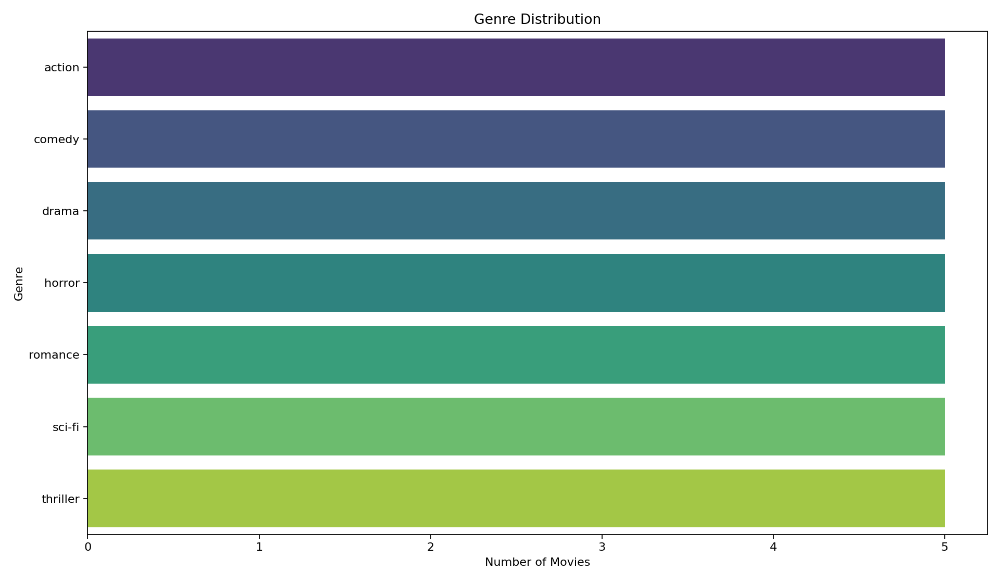
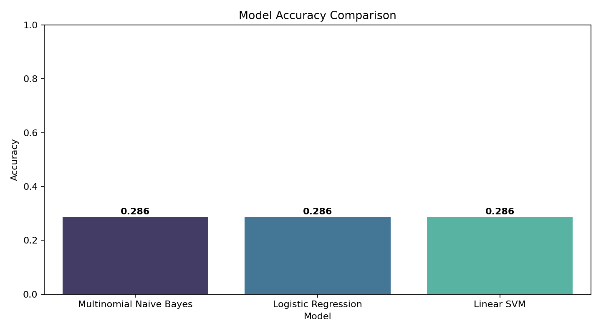
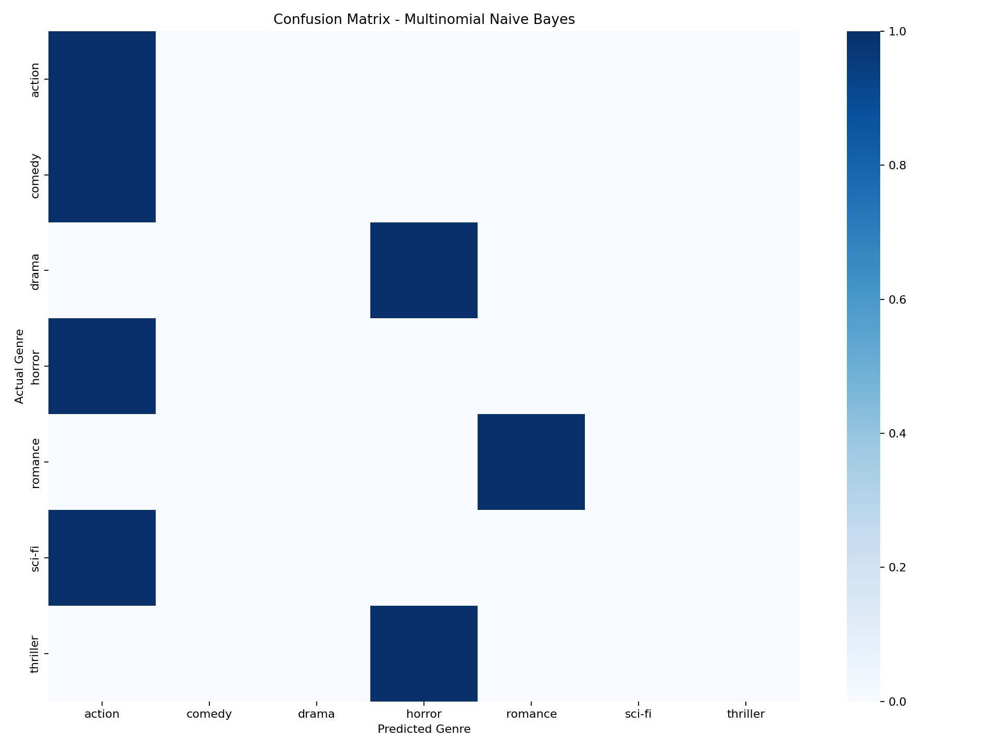

# Movie Genre Classification System

[](https://www.python.org/)
[](https://scikit-learn.org/)
[](https://streamlit.io/)
[](LICENSE)

A complete end-to-end Machine Learning and NLP project that predicts a movie genre from a plot summary. The project uses the IMDb Genre Classification Kaggle dataset, TF-IDF features, and multiple classical machine learning models.

## Project Overview

The system trains and compares:

- Multinomial Naive Bayes
- Logistic Regression
- Linear Support Vector Machine

The best-performing model is saved and served through a dark-themed Streamlit web app where users can enter a movie description, predict the genre, view a confidence score, and inspect the top 3 predicted genres.

## Dataset

Download the dataset from Kaggle:

https://www.kaggle.com/datasets/hijest/genre-classification-dataset-imdb

Place the Kaggle training file in:

```text
dataset/train_data.txt
```

The repository includes `dataset/sample_movies.csv` only so the pipeline can be smoke-tested immediately. For resume, portfolio, and GitHub results, train with the full Kaggle dataset.

## Folder Structure

```text
movie-genre-classification/
├── dataset/
│   ├── README.md
│   └── sample_movies.csv
├── notebooks/
│   └── genre_classification.ipynb
├── src/
│   ├── preprocess.py
│   ├── train_model.py
│   └── predict.py
├── models/
│   ├── model.pkl
│   ├── tfidf.pkl
│   ├── model_metadata.json
│   ├── model_results.csv
│   └── classification_report.txt
├── app/
│   └── app.py
├── screenshots/
│   ├── genre_distribution.png
│   ├── model_accuracy_comparison.png
│   └── confusion_matrix.png
├── requirements.txt
├── README.md
├── .gitignore
└── LICENSE
```

## Installation

```bash
git clone https://github.com/your-username/movie-genre-classification.git
cd movie-genre-classification
python -m venv .venv
source .venv/bin/activate
pip install -r requirements.txt
```

## Train the Models

Using the Kaggle dataset:

```bash
python src/train_model.py --dataset dataset/train_data.txt
```

Using the included sample dataset for a quick smoke test:

```bash
python src/train_model.py
```

Training outputs:

- Saved best model: `models/model.pkl`
- Saved TF-IDF vectorizer: `models/tfidf.pkl`
- Accuracy comparison: `models/model_results.csv`
- Classification report: `models/classification_report.txt`
- Charts in `screenshots/`

## Run the Streamlit App

```bash
streamlit run app/app.py
```

Then open the local URL printed by Streamlit, usually:

```text
http://localhost:8501
```

## Features

- IMDb movie plot genre prediction
- Text cleaning with lowercase conversion, punctuation removal, tokenization, and stopword removal
- TF-IDF vectorization with unigrams and bigrams
- Naive Bayes, Logistic Regression, and LinearSVC training
- Accuracy, classification report, and confusion matrix
- Model accuracy comparison chart
- Saved model and vectorizer with Joblib
- Streamlit frontend with dark UI
- Confidence score and top 3 predicted genres
- Sample movie descriptions
- GitHub-ready project structure

## Screenshots

After training, generated charts are saved in `screenshots/`.







## Future Improvements

- Train on the full Kaggle dataset and tune TF-IDF/model hyperparameters
- Add probability calibration for LinearSVC confidence scores
- Add transformer-based models such as DistilBERT or RoBERTa
- Deploy the Streamlit app to Streamlit Community Cloud
- Add automated tests and CI workflow
- Track experiments with MLflow or Weights & Biases

## License

This project is licensed under the MIT License.
